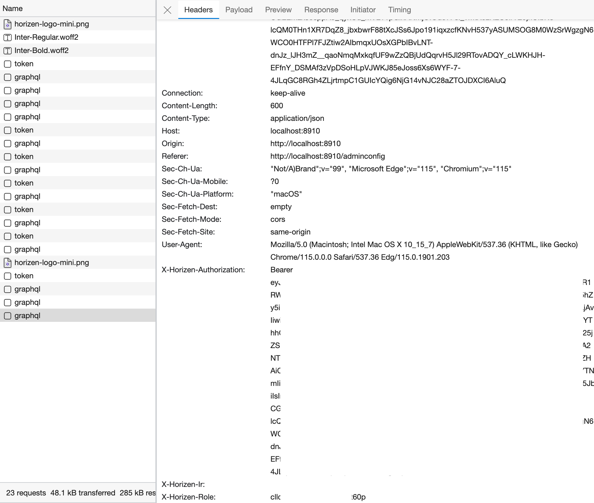
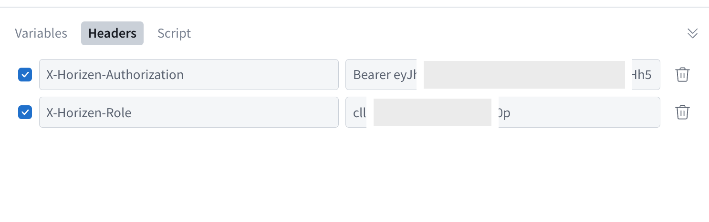
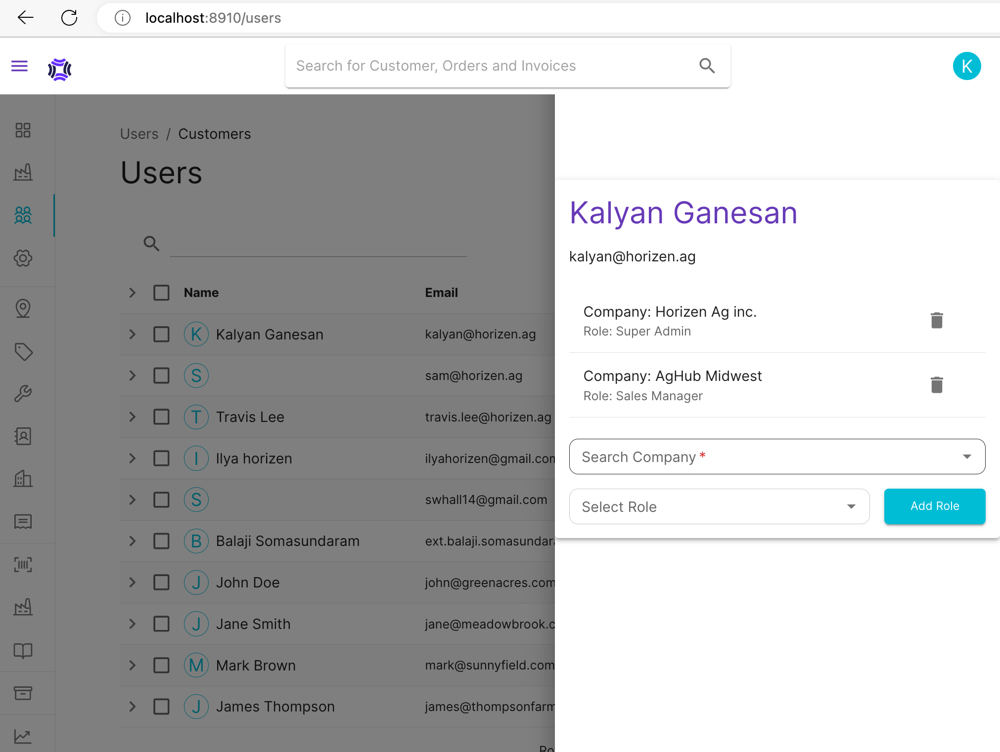

# Setting up and running the applications on your system

## Install nvm

[nvm GitHub repo](https://github.com/nvm-sh/nvm)

To install nvm run the following command in your terminal

```bash
curl -o- https://raw.githubusercontent.com/nvm-sh/nvm/v0.39.3/install.sh | bash
```

To verify that nvm has been installed, do:

```bash
command -v nvm
```

To install node, run the following command. We are currently using node 18.15.0

```bash
nvm install 18.15.0
```

If you have multiple node versions installed, make sure you set the above version as default.

```bash
nvm alias default 18.15.0
```

More node help: [Node Tutorial](https://heynode.com/tutorial/install-nodejs-locally-nvm/)

### Install Visual Studio Code

Download and Install Visual Studio Code from this [page.](https://code.visualstudio.com)

### Required VS Code Extensions

#### Prettier - Code formatter

Name: Prettier - Code formatter

Publisher: Prettier

VS Marketplace Link:
<https://marketplace.visualstudio.com/items?itemName=esbenp.prettier-vscode>

#### SonarLint

Id: SonarSource.sonarlint-vscode

Description: Detects and helps fix issues in your JS/TS, Python, PHP, Java, C, C++, Go and IaC code locally in your IDE. Use with SonarQube & SonarCloud for optimal team performance.

Version: 3.18.0

Publisher: SonarSource

VS Marketplace Link: <https://marketplace.visualstudio.com/items?itemName=SonarSource.sonarlint-vscode>

#### GraphQL: Language Feature Support

Name: GraphQL: Language Feature Support

Id: GraphQL.vscode-graphql

Description: GraphQL LSP extension that adds autocompletion, validation, go to definition, hover, outline and more.

Publisher: GraphQL Foundation

VS Marketplace Link:
<https://marketplace.visualstudio.com/items?itemName=GraphQL.vscode-graphql>

>VS Code may recommend some extensions based on the workspace. Please go ahead and install them.

### Setting up & running the backend API

[Download & Install dotnet 7](https://dotnet.microsoft.com/en-us/download)

### Setting up & running the web app

Open another terminal in VS Code and run the following commands to install dependencies

```bash
cd web
npm install
```

Create a .env file in the web folder and the following to the file

```bash
VITE_APP_CLIENT_ID="<Azure B2C Client ID>"
VITE_APP_TENANT_NAME="<Tenant Name>"
VITE_APP_POLICY_NAME="<sign-in sign-up policy>"
```

To run the web app run the following command

```bash
npm run dev
```

## Package management

### Checking for versions

```bash
npx npm-check-updates
```

### Updating all packages to latest version

__WARNING:__ _Please check for breaking changes before upgrading any package_

```bash
npx npm-check-updates -u
```

## Local Development Database Setup

You can install Postgres locally and it'll reduce your debug time by a lot.  You will need this data below to setup products locally.
First you'll need to initialize the database.

[Download Postgres](https://www.postgresql.org/download/)

### Initialize DB

Add a appsettings.Development.json file under Horizen.DataSprout project root and get the config values from Kalyan.

Follow [migration README.md](./shared/Horizen.Data/README.md) to migrate database changes

### Seeding the database

Build the Horizen.DataSprout project

Run the app

```bash

dotnet run
```

## GraphQL

GraphQL schemas are defined in .graphql files and loaded at runtime. These files need to be copied to the deployment folder. The copy:graphql script in /apis/api/package.json copies the file to the destination.

### Debugging GraphQL queries and mutations

Apollo GraphQL Sandbox is available during local development. You can navigate to the sandbox using the url <http://localhost:8910/api/graphql>. In order to test a query or a mutation, you need to set two headers:

* __Authorization__: This is the bearer token header required to authenticate the user
* __X-Horizen-Role__: This is the user role that is trying to operate on a specific resource using a query or mutation. For more information on roles check [RBAC guide](./docs/RBAC.md).

#### STEP 1: Obtaining header values for authorization & role

You can get these two values by running the app (<http://localhost:8910>) and looking at any graphql query headers in the network tab of your browser's developer tools window.



#### STEP 2: Setting Headers in Apollo GraphQL Sandbox

You can set the headers under the __Headers__ section at the bottom of the window.

>Note that the X-Horizen-Authorization header value expires every hour, so you need to obtain new value.



> If you are testing for a specific role, please ensure you have attached your user object to the company you want to be a part of (eg., an AgRetailer) with the specified role. You can do this from the __Users__ page. Please note that only _Super Admin_ or _Company Admin_ have access to this page.



## Git Pull Request

__IMPORTANT__: Your PR's should follow the naming convention below:

`[ENG-XXX] Brief description of the PR`

You can use [GitHub Desktop](https://desktop.github.com) to manage your branches.

## General Tips

### Port not available issue

Check if the port is in use using the following command

```bash
lsof -i tcp:6006
```

## Authentication & Authorization

To implement authorization for new queries and mutations, refer this [guide](./docs/RBAC.md).
